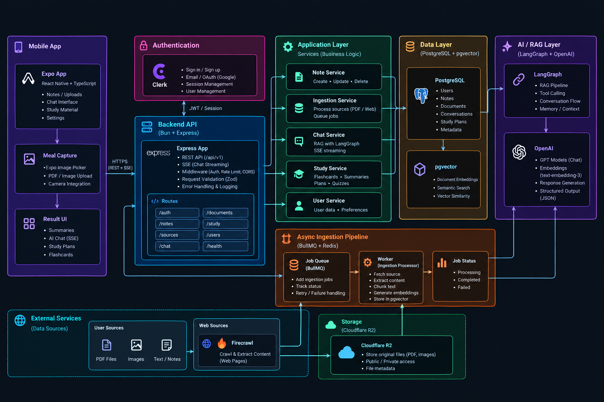

# Stubady

  

Stubady is an AI study companion that turns your own materials into an interactive learning experience. Upload PDFs, paste notes, or add web links and chat with an assistant that answers only from what you've provided. It is built to make revision faster, more focused, and actually personal to your content.

## Features

- **Study Sets** — Group sources, chats, and study outputs into one organized workspace per subject or exam.
- **Multi-source Ingestion** — Add PDFs, typed notes, and web pages; content is extracted, chunked, and made searchable automatically.
- **Chat with Your Materials** — Ask questions and get grounded answers with cited sources from your study set, plus streaming replies.
- **Auto Summaries** — Generate clean, readable Markdown summaries of any study set on demand.
- **Smart Flashcards** — Create revision decks from your sources with AI-generated question-and-answer cards.
- **Conversation History** — Keep every chat thread with paginated history and quick access to past sources.

## Tech Stack

**Server**
- Bun
- Express 5
- Prisma 7
- PostgreSQL + pgvector
- Redis + BullMQ
- Pino
- Clerk Auth
- LangChain + LangGraph + OpenAI
- Firecrawl
- Cloudflare R2

**Mobile**
- Expo 55
- React Native
- Expo Router
- Clerk Expo
- TanStack Query
- Zustand
- Zod
- React Hook Form

**Tooling**
- TypeScript
- ESLint + Prettier (root configs)
- EAS Build
- Docker Compose
- GitHub Actions
